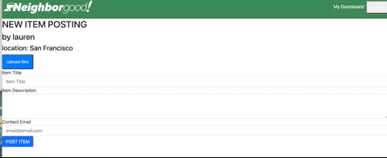

C# Neighborgood Community Sharing Application
## David Chao, Lauren Duker & Scott Everett
[](https://opensource.org/licenses/MIT)    
    
### Description
Full-stack sharing and upcycling app where neighbors can post gently used items, comment, ask questions, and claim items from other members of their community. App uses MVC architectural structure, Bootstrap, Handlebars.js, Sequelize, and express-session.

### Table of Contents

* [Link](#link)
* [Installation](#installation)
* [Usage](#usage)
* [Cloudinary](#cloudinary)
* [Contributing](#contributing)
* [Questions](#questions)
* [License](#license)


### Link 
🔗 
Link to application [Neighborgood Community Sharing Application](https://hidden-forest-09542.herokuapp.com/)


### Installation
🔧
If you plan to clone down this project for yourself, you need to install the following (dependencies): 
bcrypt, connect-session-sequelize, dotenv, express, express-handlebars, express-session, handlebars, mysql2, sequelize. 

After you clone down the repository, install dependencies from the root directory. 

~~~
npm install 
~~~

Then, move into the db/ directory and create the database in MySQL. 
~~~
mysql -u root -p
source schema.sql
~~~

Next, move back into the root directory and seed your database with the sample data. Or navigate to the seeds directory and add your own seed data, then: 
~~~
npm run seed
~~~


### Usage 
To enable the server from the command line: 

~~~
npm start
~~~

### Cloudinary 

We used Cloudinary for cloud storage and retrieval of user posted item photos. 

Cloudinary Upload widget for logged in users to post photos when they post an item. 



#### Code Snippet
Client side JavaScript to call the upload widget and retrive unique image URL from the response object. 

```
var photoURL;

var myWidget = cloudinary.createUploadWidget({
    cloudName: cloudName,
    uploadPreset: uploadPresent,
    }, (error, result) => {
        if (!error && result && result.event === "success") {
            const location_id = document.querySelector("#user-location").getAttribute("data-location");
            console.log('Done! Here is the image info: ', result.info);
            photoURL = result.info.url;
            };
    }
);

```

### Contributing 
✍️ 
David Chao, Lauren Duker & Scott Everett are the authors of this application. 

Find additional work here: 

Lauren Duker's  [Github profile.](http://github.com/laurenDarrimon).
David Chao's  [Github profile.](https://github.com/DazedChou).
& Scott Everett's [Github profile.](https://github.com/scottybuoy).

Follow these guildines for contributing to this project: 


### Questions
❓💌
Reach out to David Chao, Lauren Duker & Scott Everett at hello@laurenlalita.com if you have any questions. 

### License
The license for this project is: [MIT](https://opensource.org/licenses/MIT)
[](https://opensource.org/licenses/MIT)